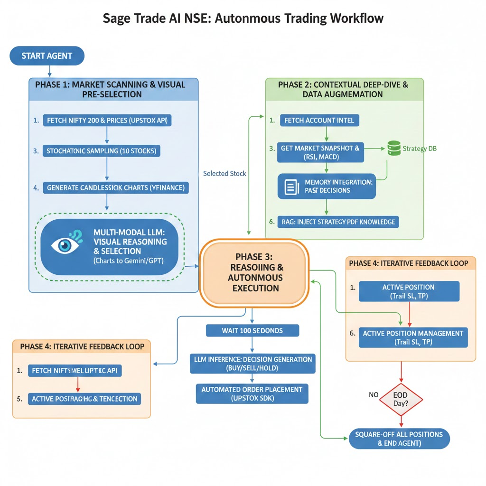

# 📈 Sage Trade AI NSE

_Automated, LLM-powered intraday stock trading agent for the NSE (National Stock Exchange of India) using Upstox Client SDK._

---

> **⚠️ Strictly for Educational & Research Purposes:**
> This project is provided for academic and learning use only. Do NOT use it for live or real-money trading without extensive validation. No warranties, financial advice, or guarantees.

---

## 📖 Overview

Sage Trade AI NSE is a next-generation trading system that combines traditional technical analysis with the cognitive power of Large Language Models (LLMs). By utilizing models like Google Gemini 1.5/2.0/3.0 and OpenAI GPT-4o/5-mini/5-pro, the agent simulates a professional human analyst.

It doesn't just look at numbers; it "reasons" through multi-modal data—including candlestick patterns, real-time news sentiment, and volume clusters—to execute high-probability intraday trades via the Upstox API.

## 📊 System Flow Diagram



## ✨ Key Features

- 🧠 **LLM-Powered Reasoning**: Moves beyond static logic to interpret market "context" and news catalysts using state-of-the-art AI.
- 📊 **Multi-Modal Analysis**: Processes both tabular technical indicators (RSI, MACD) and visual chart patterns.
- ⚡ **Automated Lifecycle**: Handles everything from morning stock selection to automated Stop-Loss (SL) management and End-of-Day (EOD) square-offs.
- 📰 **Sentiment Integration**: Uses NewsAPI to gauge market mood before entering positions.
- 🛡️ **Institutional-Grade Risk Management**: Strict position sizing based on available margin and user-defined risk-per-trade.
- 🔌 **RESTful Interface**: Built on Flask, allowing you to monitor or trigger the agent via webhooks or external dashboards.

---

## 🤖 Agentic Workflow: The Decision Engine

The Sage Trade AI NSE operates as an autonomous cycle, mimicking a high-frequency professional trader. Below is the step-by-step operational logic of the agent.

### Phase 1: Market Scanning & Visual Pre-Selection
- **Universe Filtering:** Fetches the current NIFTY 200 stock list from the NSE and retrieves real-time price snapshots via the Upstox API.
- **Stochastic Sampling:** Selects 10 high-probability stocks for visual analysis, optimizing LLM usage while preserving diversity.
- **Visual Plotting:** Uses yfinance to generate candlestick charts for these 10 candidates.
- **Multi-Modal Selection:** Sends all 10 charts to the LLM for Visual Pattern Recognition (identifies support/resistance, trends, breakouts). The LLM selects the single "Stock of the Day" with the highest edge.

### Phase 2: Contextual Deep-Dive & Data Augmentation
Once a specific stock is selected, the agent aggregates a "Full Context" payload to ensure robust decision-making:
- **Account Intel:** Fetches Upstox available margin, active portfolio positions.
- **Market Snapshot:** Provides intraday candles, volume, and technical summaries (RSI, MACD, VWAP).
- **Memory Integration:** Reviews prior trading decisions to avoid repeat mistakes.
- **Knowledge Base:** Optionally augments with proprietary training content (e.g., provided PDF of your rules).

### Phase 3: Reasoning & Autonomous Execution
- **Agentic Inference:** LLM processes the entire payload (visual, technical, historical, account data).
- **The Directive:** Outputs a strict decision: BUY, SELL, or HOLD, with reasoning, precise Entry, SL, and Target.
- **Automated Action:** The upstox_Agent SDK translates this into a live order, calculates correct quantity based on leverage and risk controls, and places the trade.

### Phase 4: Iterative Feedback Loop
- **100-Second Polling:** Complete analysis repeats every 100 seconds; not a "buy and forget" agent.
- **Active Management:** Reassesses all live positions—trails stops, takes profit, or exits as market conditions shift.


## 🏗️ Technical Architecture Detail
| Component            | Technology                                      |
|----------------------|-------------------------------------------------|
| Market Data          | Upstox API & yfinance                           |
| Visual Reasoning     | LLM (Gemini-Vision / GPT-4o)                    |
| Strategy Logic       | RAG (Retrieval-Augmented Generation), PDF rules |
| Execution            | Upstox Python SDK                               |
| Scheduling           | Async loop, 100s polling interval               |

## 🛡️ Operational Safeguards
- **Dynamic Margin Check:** Will not attempt trade if available margin is below threshold.
- **Leverage Control:** Uses configured Intraday Leverage to maximize efficiency, avoiding liquidation.
- **Portfolio Awareness:** Cross-references active positions, prevents conflicts and overexposure.

---

## 🚀 Getting Started

Follow these steps to get the agent running in your local environment.

### 1. Prerequisites
- Python 3.10 or higher
- A valid Upstox Developer Account (to get API keys)
- PostgreSQL installed and running
- LLM Keys (Gemini/ChatGPT)

### 2. Installation
```bash
git clone https://github.com/RahulAgrwal/SageTrade-AI-NSE.git
cd sage-trade-ai-nse
pip install -r requirements.txt
```

### 3. Environment Configuration

Create a `.env` file in the root directory. Use the template below:
```
# UPSTOX CREDENTIALS
UPSTOX_API_KEY=your_api_key_here
UPSTOX_API_SECRET=your_api_secret_here
UPSTOX_REDIRECT_URI=http://127.0.0.1
UPSTOX_ACCESS_TOKEN=your_access_token_here

# LLM CONFIGURATION
OPENAI_API_KEY=your_openai_key_here
OPENAI_MODEL=gpt-5-mini
GEMINI_API_KEY=your_gemini_key_here
GEMINI_MODEL=gemma-3-27b

# EXTERNAL DATA
NEWS_API_KEY=your_news_api_key_here

# DATABASE
DB_HOST=localhost
DB_NAME=sage_trade_ai_nse
DB_USER=postgres
DB_PASS=your_db_password
DB_PORT=5432
```

### 4. Database Setup
```sql
CREATE DATABASE sage_trade_ai_nse;
```

### 5. Launch the Agent
```bash
python main.py
```

## 📂 Project Structure
| File                            | Description                                      |
|---------------------------------|--------------------------------------------------|
| main.py                        | Entry point for the server and trading engine     |
| trading_agent.py                | The "Brain" – orchestrates logic, risk checks, execution |
| llm_integration.py              | Handles API calls to OpenAI and Google Gemini     |
| upstox_wrapper.py               | Interface for Upstox SDK (Orders, Data, Positions)|
| config.py                       | Centralized settings for risk limits, trading hours |
| prompts.py                      | System prompts that define the LLM's trading persona |
| intraday_technical_analyzer.py  | Computes RSI, MACD, Bollinger Bands, and VWAP    |
| news_fetcher.py                 | Pulls real-time, stock-specific news via NewsAPI  |

## ⚠️ Security & Risk Disclaimer
- **Paper Trading First**: It is highly recommended to run this in a "Paper Trading" or "Sandbox" mode before committing real capital.
- **Strictly for Education/Learning**: Not intended for live-money or untested production use. No investment advice or guarantee of results.
- **Financial Risk**: Trading stocks involves significant risk of loss. This software is provided "as is" for educational and research purposes.
- **Key Safety**: Never commit your .env file to version control (GitHub/GitLab). Use .gitignore.

## 📜 License
Distributed under the MIT License. See LICENSE for more information.
